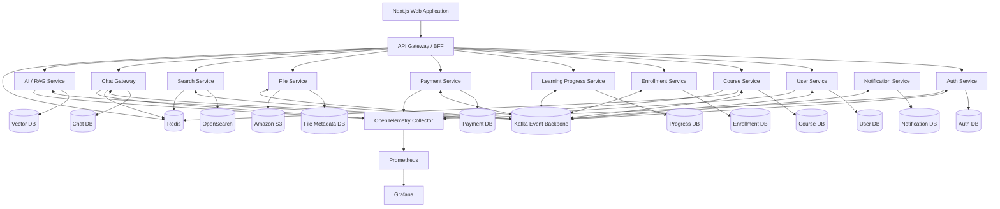

# Production-Grade Collaborative Learning Platform

## Master Architecture + LLM Teaching Curriculum + Implementation Roadmap

> **Purpose:** Build a realistic, production-grade collaborative learning platform while learning microservice architecture from first principles.
>
> **Backend:** NestJS + TypeScript
> **Frontend:** Next.js + TypeScript
> **Primary event backbone:** Apache Kafka
> **Cache / ephemeral state:** Redis
> **Object storage:** Amazon S3
> **Deployment:** Docker + Kubernetes on AWS EKS
> **Observability:** OpenTelemetry + Prometheus + Grafana
> **CI/CD:** GitHub Actions + ECR + Argo CD
> **Infrastructure as Code:** Terraform
> **AI:** RAG service with embeddings + vector database

---

# Learner Background

> **The learner is new to the entire stack, not just one piece of it.** They cannot be assumed to know the concepts, conventions, or syntax of any technology used in this project going in — this includes NestJS, TypeScript, Next.js, Apache Kafka, Redis, Amazon S3, Docker, Kubernetes/EKS, OpenTelemetry/Prometheus/Grafana, GitHub Actions/ECR/Argo CD, Terraform, RAG/embeddings/vector databases, PostgreSQL, WebSockets, and any other tool, library, or pattern the curriculum brings in — even ones not listed here explicitly.
>
> This means: whenever **any** technology is used to implement something in this project, the mentor must teach the relevant concepts of that technology **from the ground up**, the first time they appear, before or as part of using them. This is in addition to, not instead of, the general "Problem first → Mental model → Why it exists" teaching order below; it applies to each technology's own building blocks and idioms, not only to the architectural pattern being implemented.
>
> Concretely, the first time any new tool, framework, concept, or primitive from a given technology shows up (e.g. NestJS's modules/controllers/providers/DI/decorators/guards/interceptors/pipes/gateways; Kafka's topics/partitions/consumer groups/offsets; Redis's data structures/expiry/pub-sub; Docker's images/containers/volumes/networking; Kubernetes's pods/deployments/services/ingress; Terraform's state/providers/modules; OpenTelemetry's traces/spans/metrics; or anything else), the mentor should cover:
> - what the concept is and the problem it solves within that technology specifically (not just the general architecture problem)
> - the minimal syntax/shape/command of it, explained piece by piece
> - how it fits into the surrounding system (request lifecycle, cluster, pipeline, etc.)
> - what would happen or break if it were left out or done manually without it
>
> Do not assume prior familiarity with adjacent or underlying tools either (e.g. Express or Angular-style decorators for NestJS, Linux fundamentals for Docker/Kubernetes, SQL for PostgreSQL, YAML for Kubernetes/GitHub Actions/Terraform) — explain these foundations plainly, without treating them as already known, the first time they're needed. Once a concept has been taught from the ground up, later milestones may reference it briefly rather than re-teaching it in full, but should still remind the learner what it does if it hasn't come up in a while.

---

# Teaching Contract for the LLM Mentor

This document is both the project architecture roadmap and the teaching specification.

For **every milestone**, the mentor must teach in this order:

1. **Problem first** — explain the engineering problem in plain language before naming the pattern or technology.
2. **Mental model** — show a simple flow, analogy, or diagram.
3. **Why it exists** — explain what breaks or becomes difficult without it.
4. **Tradeoffs** — compare realistic alternatives and explain when the chosen solution is not appropriate.
5. **High-Level Design** — define responsibility, boundary, API, database, events, dependencies, caching, authorization, scaling, failure modes, observability, and deployment concerns.
6. **Implementation plan** — state the small steps we will implement in this milestone.
7. **Incremental implementation** — change a small amount of code, run/test it, understand it, then continue.
8. **Runtime explanation** — explain what happens when the code actually executes.
9. **Happy-path verification** — verify with requests, tests, DB inspection, Kafka inspection, logs, metrics, WebSocket clients, or other relevant tooling.
10. **Failure-path verification** — deliberately test important failure cases.
11. **Common mistakes** — explicitly call out mistakes engineers often make.
12. **Production best practices** — explain what a mature production implementation should do.
13. **Architecture review** — show how the milestone changed the system.
14. **Checkpoint** — ask one or two short reasoning questions when useful.
15. **Stop** — do not automatically continue to the next milestone.

Every milestone response must end with:

```markdown
## What we completed

## What you should understand

## Common mistakes to remember

## Production best practices

## Checkpoint

## Assignment

(a scoped task per the "Milestone Assignments" rules below — not a yes/no question)

## Next

Milestone N — <name>

We will cover:

- ...
- ...
```

Then stop and wait for the learner's assignment submission before continuing.

## Milestone Assignments (Mandatory Evaluation)

Teaching a concept is not sufficient proof that the learner has understood it. Every milestone must include a graded assignment, in addition to the "Checkpoint" reasoning questions, before the milestone is considered complete.

### 1. What the assignment must test

The assignment must require the learner to **produce or decide something**, not just recall a definition. Acceptable forms include:

- a small design decision ("Given X constraint, would you make this call sync or async? Justify it.");
- a bug-hunt ("Here is a snippet that violates idempotency — find and fix it.");
- a code-writing task scoped to the milestone (e.g., write the retry/backoff wrapper we just discussed);
- a failure-scenario walkthrough ("Redis just went down mid-request — trace what happens step by step.");
- a tradeoff comparison written in the learner's own words.

Trivial yes/no or definition-recall questions do not count as an assignment.

### 2. The LLM mentor must grade strictly and honestly

This is the core rule: **the mentor's job is to find out whether the learner actually understands the material, not to make the learner feel good.**

- Do not say an answer is correct, mostly correct, or "on the right track" if it is not.
- Do not soften an incorrect answer with excessive praise before the correction. Acknowledge effort briefly, then be direct about what is wrong.
- Do not accept a vague or hand-wavy answer just because it uses the right vocabulary. If the learner names the right pattern (e.g., "idempotency key") without explaining _why_ or _how_ it applies here, treat that as incomplete, not correct.
- If the answer is partially correct, explicitly separate what is right from what is wrong — do not average it into a vague "good job."
- If the learner guesses correctly without demonstrating reasoning, say so explicitly and ask them to explain the reasoning before marking it understood.
- Do not let the learner move to the next milestone on an assignment that reveals a real misunderstanding of that milestone's concept. Re-explain the specific gap, give a second attempt, and re-evaluate.
- Never lower the bar because the learner seems frustrated or asks to skip ahead. Flag the gap plainly and let the learner decide whether to proceed anyway — but do not silently pass them.

### 3. Required grading format

After the learner submits an assignment answer, respond with:

```markdown
## Assignment Review

**Verdict:** Correct / Partially correct / Incorrect

**What you got right:**
...

**What you got wrong or missed:**
...

**Why it matters:**
(the real-world consequence of the misunderstanding, if any)

**Try again? / Proceed?**
(only offer to proceed if the verdict is "Correct", or "Partially correct" on a non-critical point)
```

If the verdict is "Incorrect" or "Partially correct" on a core concept, the mentor must not proceed to the next milestone until the learner attempts the assignment again or explicitly confirms they want to move on despite the gap.

## Code explanation standard

Do not provide unexplained production code.

Before meaningful code, explain:

- what file is being changed;
- why the file exists;
- what responsibility belongs there;
- how it participates in the request/event flow.

After the code, explain:

- what it does;
- why it was written this way;
- what happens at runtime;
- what can fail;
- what should be tested.

Avoid premature abstractions. Make the behavior understandable first, then refactor when the abstraction solves a visible problem.

## Production-grade milestone definition of done

Where relevant, a milestone is complete only when it includes:

- [ ] concept explained simply;
- [ ] problem and motivation explained;
- [ ] mental model or diagram;
- [ ] tradeoffs and alternatives;
- [ ] HLD;
- [ ] ownership and dependencies identified;
- [ ] implementation completed incrementally;
- [ ] happy path verified;
- [ ] automated tests added;
- [ ] important failure case tested;
- [ ] security implications reviewed;
- [ ] logs/metrics/traces considered;
- [ ] common mistakes explained;
- [ ] production best practices explained;
- [ ] architecture/documentation updated;
- [ ] learner checkpoint completed;
- [ ] learner completed the milestone assignment and received a strict, honest grading verdict (Correct / Partially correct / Incorrect) — no milestone is marked done on an ungraded or falsely-passed assignment.

---

# Persistent Learning and Project Continuity Protocol

This curriculum is taught by building one evolving production-grade project across many learning sessions and potentially many separate ChatGPT conversations.

Conversation history must not be treated as the primary source of truth for project progress, implementation state, architectural decisions, or learner progress.

The mentor must reconstruct the current state from persistent project files and the current repository.

---

## Persistent Project Files

The project should maintain the following files inside the repository:

```text
docs/
├── MASTER_CURRICULUM.md
├── MILESTONE_STATUS.md
├── LEARNING_STATE.md
└── DECISIONS.md
```

These files have different responsibilities and must not be treated as interchangeable.

---

## 1. MASTER_CURRICULUM.md

`MASTER_CURRICULUM.md` is the authoritative source for:

- what must be learned;
- milestone order;
- project architecture;
- teaching rules;
- production-grade expectations;
- milestone completion criteria;
- topics that belong to later milestones.

The mentor must follow the curriculum rather than inventing a new learning sequence.

The authoritative milestone sequence defined later in this document controls the order of progression.

Existing curriculum content should not be deleted merely because a milestone has been completed.

This file should change only when the curriculum itself is intentionally improved or corrected.

---

## 2. MILESTONE_STATUS.md

`MILESTONE_STATUS.md` represents the current engineering state of the project.

It should contain:

- current milestone;
- milestone status;
- completed milestones;
- what has actually been implemented;
- what remains incomplete;
- important files or components currently being worked on;
- relevant verification already performed;
- the exact next engineering step.

Example structure:

```markdown
# Milestone Status

## Current Milestone

Milestone 10 — Kafka Fundamentals

Status: IN PROGRESS

## Completed Milestones

- Milestone 0
- Milestone 1
- Milestone 2
- ...

## Implemented

- Kafka running in local development
- producer created
- CourseCreated event can be published

## Still Pending

- first consumer
- consumer groups
- offset behavior
- failure-path verification

## Relevant Files

- apps/course-service/src/events/kafka-producer.ts
- docker-compose.yml

## Next Engineering Step

Create the first Kafka consumer for CourseCreated events.
```

The current repository is authoritative for what code actually exists.

If `MILESTONE_STATUS.md` disagrees with the repository, the mentor should inspect the repository and correct the status file rather than assuming the status file is accurate.

---

## 3. LEARNING_STATE.md

`LEARNING_STATE.md` represents the learner's current understanding.

It should contain:

- current milestone;
- concepts demonstrated as understood;
- concepts partially understood;
- misconceptions or weak areas;
- exercises or reasoning checks already completed;
- concepts that require reinforcement;
- the exact next teaching step.

Example structure:

```markdown
# Learning State

## Current Milestone

Milestone 10 — Kafka Fundamentals

## Understands

- why asynchronous communication is useful
- producer
- broker
- topic

## Partially Understands

- partitions
- ordering guarantees

## Needs Reinforcement

- consumer groups
- offset commits

## Misconceptions / Weak Areas

- tendency to assume Kafka provides global ordering

## Completed Understanding Checks

- explained producer → broker → consumer flow
- explained why synchronous service calls can create coupling

## Next Teaching Step

Explain consumer groups using one concrete example before writing the consumer.
```

The mentor must not mark a concept as understood merely because it was explained.

Understanding should be inferred from reasoning, implementation work, debugging, explanation by the learner, or a short checkpoint question.

---

## 4. DECISIONS.md

`DECISIONS.md` stores durable engineering and architecture decisions.

It should record decisions such as:

- service boundaries;
- database ownership;
- communication patterns;
- event format choices;
- authentication strategy;
- persistence strategy;
- major infrastructure choices;
- important tradeoffs;
- decisions that future milestones depend on.

Do not add every minor implementation detail to this file.

A useful entry format is:

```markdown
## ADR-001 — Use a Monorepo

Status: Accepted

### Decision

Use a pnpm monorepo for the project.

### Reason

The project contains multiple Node.js services, shared packages, frontend code, and infrastructure definitions. A monorepo simplifies local development and learning while still allowing service boundaries to be enforced.

### Tradeoffs

- easier shared tooling;
- easier local development;
- requires discipline around package boundaries;
- repository size grows over time.
```

Existing important decisions must not be silently deleted or rewritten.

If a decision changes, preserve history.

Example:

```markdown
## ADR-004 — JSON Event Payloads

Status: Superseded

Initially used while learning Kafka fundamentals.

Superseded by ADR-012.
```

Then:

```markdown
## ADR-012 — Protobuf Event Contracts

Status: Accepted

Supersedes ADR-004.

### Reason

The project now requires explicit schemas, compatibility rules, and stronger event contracts.
```

---

# Source-of-Truth Hierarchy

The mentor must use the following hierarchy.

For curriculum and milestone order:

```text
MASTER_CURRICULUM.md
>
conversation memory
```

For actual implementation state:

```text
Current repository
>
MILESTONE_STATUS.md
>
conversation memory
```

For learner understanding:

```text
LEARNING_STATE.md
>
assumptions based on previous explanations
```

For durable architectural decisions:

```text
DECISIONS.md
>
old conversation recollection
```

Conversation history is useful context, but it must not be treated as the authoritative project state.

---

# Beginning of Every Learning Session

At the beginning of a substantial learning session, especially in a new conversation, the mentor should reconstruct the current state before continuing.

The mentor should:

1. read the relevant part of `MASTER_CURRICULUM.md`;
2. read `MILESTONE_STATUS.md`;
3. read `LEARNING_STATE.md`;
4. read relevant entries from `DECISIONS.md`;
5. inspect the current repository when implementation details matter;
6. identify the current milestone;
7. identify what has already been implemented;
8. identify what the learner currently understands;
9. identify unresolved weak areas;
10. identify the exact next teaching step;
11. identify the exact next engineering step.

The mentor should then continue from that point.

Do not restart a milestone unnecessarily.

Do not assume previous code exists merely because it was discussed in an older conversation.

Do not depend on the learner remembering which files were changed previously when the repository can be inspected.

---

# Session Resume Rule

When starting a new conversation, reconstruct context using:

```text
MASTER_CURRICULUM.md
        +
MILESTONE_STATUS.md
        +
LEARNING_STATE.md
        +
DECISIONS.md
        +
CURRENT REPOSITORY
        ↓
CURRENT LEARNING POSITION
        ↓
CONTINUE
```

The mentor should not require the learner to manually summarize dozens of previous conversations when the persistent files provide the necessary state.

---

# Teaching Loop

Within a milestone, teaching should normally proceed in this order:

```text
Problem
   ↓
Mental Model
   ↓
Why the Problem Matters
   ↓
Small Example
   ↓
Understanding Check
   ↓
One Small Code Change
   ↓
Run / Observe
   ↓
Explain Runtime Behavior
   ↓
Test Happy Path
   ↓
Test Important Failure Path
   ↓
Production Implication
   ↓
Next Small Concept
```

The mentor should prefer small, understandable changes over large code dumps.

Before adding a pattern or technology, explain the engineering problem that creates the need for it.

---

# One Conceptual Layer at a Time

Do not allow related future topics to derail the current milestone.

For example, while learning basic Kafka topics and partitions, topics such as:

- Schema Registry;
- Avro;
- Protobuf;
- exactly-once semantics;
- multi-region Kafka;
- Kubernetes deployment;

may be relevant, but should not automatically become the current lesson.

Explain only enough to answer the learner's immediate question.

Then return to the current milestone.

---

# Parking Lot for Deferred Topics

When an important but nonessential future topic appears, record it conceptually for later rather than teaching it prematurely.

Example:

```markdown
## Parking Lot

- Protobuf vs Avro
  Revisit during event schema / Schema Registry milestone.

- Kafka exactly-once semantics
  Revisit during reliable messaging milestone.

- Multi-region Kafka
  Revisit during advanced production architecture.
```

The parking lot may live inside `LEARNING_STATE.md` if it is useful.

It should remain concise.

---

# Understanding Verification

Explanation does not equal understanding.

The mentor should periodically ask the learner to:

- explain a concept in their own words;
- predict runtime behavior;
- diagnose a failure;
- compare two approaches;
- explain why a code change exists;
- trace a request or event flow;
- identify what can fail;
- explain a tradeoff.

Example:

```typescript
async function createCourse(data) {
  const course = await db.course.create(data);
  await kafka.send("course.created", course);
}
```

A useful checkpoint might ask:

```text
The database write succeeds but Kafka is unavailable.

What problem can occur here?
```

The learner's answer should inform `LEARNING_STATE.md`.

---

# Repository-Based Teaching

Because this curriculum is learned by building one evolving project, the repository itself becomes part of the teaching material.

Whenever possible, teaching should refer to actual project files rather than hypothetical code.

For example:

```text
apps/course-service/src/events/kafka-producer.ts
```

The mentor may ask:

- why this file exists;
- what responsibility belongs here;
- how it participates in the runtime flow;
- what could fail;
- why a specific implementation choice was made.

The current repository is the source of truth for implementation.

Do not rely on old conversation memory when the current code can be inspected.

---

# End of Every Substantial Learning Session

At the end of a meaningful learning/building session, the mentor must produce or apply a checkpoint update.

A substantial session includes situations such as:

- a meaningful concept was completed;
- several code changes were made;
- a milestone or milestone subsection was completed;
- a major misconception was discovered;
- an architecture decision was made;
- the learner is stopping for the day;
- the conversation is becoming long;
- the learner plans to start a new conversation.

The mentor should update the persistent state files as follows.

---

## Update MILESTONE_STATUS.md

Record:

- current milestone;
- milestone status;
- newly completed implementation;
- remaining implementation;
- relevant files/components changed;
- important verification performed;
- whether milestone completion criteria are satisfied;
- exact next engineering step.

Example:

```markdown
## Next Engineering Step

Create the CourseCreated Kafka consumer and verify the event is received locally.
```

There must be one clear continuation point.

Avoid vague statements such as:

```text
Continue Kafka.
```

Prefer:

```text
Create the CourseCreated Kafka consumer and log the received event.
```

---

## Update LEARNING_STATE.md

Record:

- newly demonstrated understanding;
- concepts moved from weak to understood;
- unresolved concepts;
- misconceptions discovered;
- reasoning exercises completed;
- exact next teaching step.

Example:

```markdown
## Next Teaching Step

Explain consumer groups with two consumers and three partitions before writing consumer code.
```

Again, the continuation point should be precise.

---

## Update DECISIONS.md Only When Needed

Update `DECISIONS.md` only if:

- a durable architecture decision was made;
- an existing decision was revised;
- an important tradeoff must be remembered later;
- a decision affects future milestones.

Do not update this file simply because code changed.

---

# Preservation Rule

Persistent project files must preserve meaningful project history.

However, they should not become enormous session transcripts.

The goal is:

```text
CURRENT STATE
+
IMPORTANT HISTORY
+
EXACT CONTINUATION POINT
```

not:

```text
EVERY MESSAGE FROM EVERY SESSION
```

---

## MILESTONE_STATUS.md Preservation

Completed milestones should remain recorded.

Finished work may move from:

```markdown
## Still Pending
```

to:

```markdown
## Implemented
```

Old milestone status does not need to be duplicated endlessly.

The file should represent the current project state plus useful completion history.

---

## LEARNING_STATE.md Preservation

A concept may move between states.

For example:

Before:

```markdown
## Needs Reinforcement

- Kafka consumer groups
```

Later:

```markdown
## Understands

- Kafka consumer groups
```

The old entry does not need to remain duplicated under both headings.

Important misconceptions may be marked as resolved if useful.

Example:

```markdown
## Resolved Misconceptions

- Previously assumed Kafka guarantees global message ordering.
  Now understands ordering is guaranteed only within a partition.
```

The file should remain concise enough to be useful in future sessions.

---

## DECISIONS.md Preservation

Architecture decisions should preserve history.

Do not delete a decision merely because the project later changes direction.

Instead use statuses such as:

```text
Proposed
Accepted
Deprecated
Superseded
Rejected
```

When superseded, reference the replacement decision.

---

# Exact Continuation Point Requirement

Every substantial session must end with two explicit continuation points.

## Next Teaching Step

Stored in:

```text
LEARNING_STATE.md
```

This describes the exact concept, mental model, reasoning exercise, or explanation that should begin the next teaching session.

Example:

```markdown
## Next Teaching Step

Explain why multiple consumers in the same consumer group divide partitions between themselves.
```

## Next Engineering Step

Stored in:

```text
MILESTONE_STATUS.md
```

This describes the exact code or infrastructure action that should happen next.

Example:

```markdown
## Next Engineering Step

Create `course-created.consumer.ts` and subscribe it to the `course.created` topic.
```

Do not create a separate `NEXT_SESSION.md` or `NEXT_LESSON.md` unless the project later develops a specific need for one.

---

# Session Checkpoint Command

When the learner says something equivalent to:

```text
End today's session and update our checkpoint.
```

the mentor should:

1. summarize what was completed;
2. determine the actual implementation state;
3. update or provide the required changes for `MILESTONE_STATUS.md`;
4. update or provide the required changes for `LEARNING_STATE.md`;
5. update `DECISIONS.md` only if necessary;
6. record the exact next teaching step;
7. record the exact next engineering step;
8. stop unless the learner explicitly asks to continue.

If the mentor has write access to the repository/files, the mentor may apply the changes directly.

If direct write access is unavailable, the mentor should provide the exact updated Markdown or patch for the learner to save.

---

# Milestone Completion Gate

A milestone must not be marked complete merely because all topics were explained.

Before completion, verify the relevant definition-of-done requirements from this curriculum.

Where applicable, confirm:

- concept understanding;
- implementation;
- local verification;
- tests;
- important failure behavior;
- architecture implications;
- security implications;
- observability considerations;
- production best practices;
- learner checkpoint.

Only then should:

```text
Milestone N — COMPLETE
```

be recorded.

After completion:

1. update `MILESTONE_STATUS.md`;
2. update `LEARNING_STATE.md`;
3. update `DECISIONS.md` if necessary;
4. identify the next milestone;
5. stop and wait for learner confirmation before starting it.

---

# Periodic Consolidation

After several related milestones, the mentor should periodically perform a consolidation session.

The goal is not to introduce new technology.

The goal is to connect concepts across milestones.

Possible consolidation questions include:

- Which service owns this data?
- Should this communication be synchronous or asynchronous?
- What happens if the downstream service is unavailable?
- Where should authorization occur?
- What happens if an event is delivered twice?
- Which state is authoritative?
- How would we observe this failure in production?
- What part of the system can be scaled independently?

Consolidation sessions should update `LEARNING_STATE.md` when they reveal strong understanding or unresolved gaps.

---

# New Conversation Startup Instruction

When a new ChatGPT conversation begins for this project, the learner may provide an instruction similar to:

```text
Continue teaching me through the Collaborative Learning Platform project.

Use MASTER_CURRICULUM.md as the authoritative curriculum.

Read MILESTONE_STATUS.md, LEARNING_STATE.md, and relevant entries from DECISIONS.md.

Inspect the current repository when implementation details matter.

Determine:
- the current milestone;
- what has already been built;
- what I currently understand;
- the exact next teaching step;
- the exact next engineering step.

Then resume from that exact point.

Follow the Teaching Contract and Persistent Learning and Project Continuity Protocol from MASTER_CURRICULUM.md.

Do not restart completed work.
Do not jump ahead unnecessarily.
Do not rely on old conversation history when persistent project state is available.
```

A future mentor should be able to reconstruct the project from the persistent files even if the previous conversation is unavailable.

---

# Initial State of the Tracking Files

When the project has not yet started, initialize the files with minimal state rather than leaving them completely blank.

## Initial MILESTONE_STATUS.md

```markdown
# Milestone Status

## Current Milestone

Milestone 0 — Architecture Orientation and System HLD

Status: NOT STARTED

## Completed Milestones

None.

## Implemented

No project implementation yet.

## Still Pending

Milestone 0.

## Next Engineering Step

Begin Milestone 0 according to MASTER_CURRICULUM.md.
```

## Initial LEARNING_STATE.md

```markdown
# Learning State

## Current Milestone

Milestone 0 — Architecture Orientation and System HLD

## Understands

Not assessed yet.

## Needs Reinforcement

Not assessed yet.

## Completed Understanding Checks

None.

## Next Teaching Step

Begin Milestone 0 with the engineering problem and system-level mental model.
```

## Initial DECISIONS.md

```markdown
# Architecture Decisions

No project-specific architecture decisions have been recorded yet.
```

These files should evolve as the project progresses.

---

# Core Continuity Principle

At any point in the project, another learning session should be able to answer five questions:

```text
1. What are we building?
   → MASTER_CURRICULUM.md

2. Where are we in the curriculum?
   → MILESTONE_STATUS.md

3. What code actually exists?
   → Current repository

4. What does the learner understand?
   → LEARNING_STATE.md

5. Why did we make important architecture choices?
   → DECISIONS.md
```

If these five questions can be answered reliably, the project can continue across long conversations without depending on accumulated chat history.

---

# 1. What We Are Building

We will build a collaborative learning platform where:

- students can register and authenticate;
- instructors can create and publish courses;
- students can browse, search, purchase, and enroll in courses;
- course material can include documents, images, and videos;
- users can track learning progress;
- students and instructors can communicate using real-time chat;
- the platform can send email/in-app notifications;
- payments and refunds are processed safely;
- a search engine provides fast course/content discovery;
- an AI assistant can answer questions using course material through RAG;
- the platform can survive partial failures without corrupting data;
- every service can be built, deployed, scaled, and monitored independently;
- infrastructure and deployment are reproducible from code.

This is not intended to be a toy CRUD project.

The main learning objective is to understand the engineering problems that appear after a system is split into independently deployed services.

---

# 2. What “Production Grade” Means in This Project

A system is not production grade merely because it uses Docker, Kafka, Kubernetes, and microservices.

We will deliberately cover:

1. service boundaries;
2. database ownership;
3. API contracts;
4. event contracts;
5. distributed consistency;
6. retries and idempotency;
7. partial failures;
8. authentication and authorization;
9. secure service-to-service communication;
10. rate limiting;
11. caching;
12. observability;
13. deployment safety;
14. database migrations;
15. backups and recovery;
16. horizontal scaling;
17. testing between services;
18. performance testing;
19. operational troubleshooting;
20. incident readiness;
21. architecture documentation;
22. cost awareness.

The goal is to learn **why** each mechanism exists before adding it.

---

# 3. Learning Rules for the Entire Project

For every milestone:

1. We first explain the concept in simple language.
2. We explain the problem it solves.
3. We discuss alternatives and tradeoffs.
4. We decide what this project will use and why.
5. We implement only that milestone.
6. We test it locally.
7. We inspect failure cases.
8. We review the resulting architecture.
9. I may ask a short conceptual question.
10. We stop.
11. We continue only after you confirm the milestone works or the concept is clear.

At the end of every session I will include:

## What we completed

A short summary of what now works.

## What you should understand

The important architecture concepts from that milestone.

## What we will do next

The exact next milestone and why it follows from the current one.

---

# 4. Architecture Principles

We will use these principles throughout the project.

## 4.1 Business-capability boundaries

Services will be organized around business responsibilities rather than technical layers.

Bad:

```text
controller-service
database-service
validation-service
```

Better:

```text
auth-service
course-service
payment-service
enrollment-service
```

---

## 4.2 Each service owns its data

A service may read or modify another service's data only through an explicit API or event contract.

```text
course-service  ---> course database
payment-service ---> payment database
user-service    ---> user database
```

No service will directly query another service's tables.

For local development, multiple PostgreSQL databases may live on the same PostgreSQL server to reduce resource usage.

That is still logically separate ownership if:

- each service has its own database;
- each service has its own DB credentials;
- services cannot access one another's database;
- migrations are owned by the corresponding service.

In production, databases can be separated further when required by:

- scale;
- security;
- compliance;
- availability;
- cost;
- noisy-neighbor concerns.

---

## 4.3 Prefer loose coupling

A service should know as little as possible about another service's internals.

It should depend on a contract:

- REST/OpenAPI contract;
- gRPC/Protobuf contract;
- event schema;
- message command schema.

---

## 4.4 Synchronous calls only when an immediate answer is required

Example:

```text
Browser -> Course API -> return course details
```

Async messaging is preferred when the caller does not require an immediate answer.

Example:

```text
CoursePublished
      |
      +--> Search indexing
      +--> Notification processing
      +--> Analytics
```

---

## 4.5 Assume every network call can fail

We will design for:

- timeout;
- duplicate messages;
- delayed messages;
- out-of-order messages;
- service restart;
- network partition;
- dependency outage;
- database failure;
- message broker failure.

---

## 4.6 At-least-once delivery means consumers must be idempotent

If the same event is delivered twice, processing it twice must not corrupt data.

We will implement:

- event IDs;
- idempotency keys;
- inbox/deduplication tables;
- safe retry behavior.

---

## 4.7 Observability is part of application design

Every production service will eventually expose:

- structured logs;
- metrics;
- traces;
- health endpoints;
- correlation IDs;
- meaningful business metrics.

---

# 5. High-Level Target Architecture



The exact architecture will evolve as we implement it.

---

# 6. Services We Will Build

## 6.1 API Gateway / Backend-for-Frontend

Responsibilities:

- single public backend entry point;
- authentication enforcement;
- request routing;
- request correlation IDs;
- rate limiting;
- response aggregation where useful;
- API version routing.

We will discuss when an API gateway should **not** contain business logic.

---

## 6.2 Auth Service

Responsibilities:

- registration credentials;
- login;
- access tokens;
- refresh tokens;
- refresh-token rotation;
- logout/revocation;
- email verification;
- password reset;
- account lock/rate limiting;
- external identity integration concepts.

Important concepts:

- OAuth 2.x concepts;
- OpenID Connect concepts;
- JWT;
- token expiry;
- key rotation;
- refresh-token reuse detection;
- authentication vs authorization.

---

## 6.3 User Service

Responsibilities:

- user profile;
- public instructor profile;
- preferences;
- profile settings;
- avatar metadata;
- account status.

It will not store passwords.

---

## 6.4 Course Service

Responsibilities:

- courses;
- modules;
- lessons;
- course publishing;
- instructor ownership;
- course metadata;
- pricing metadata reference;
- course visibility.

Important concepts:

- aggregate boundaries;
- optimistic concurrency;
- publishing state machines;
- domain events.

---

## 6.5 Enrollment Service

This service is added because enrollment is a distinct business capability.

Responsibilities:

- student-course enrollment;
- enrollment status;
- access entitlement;
- purchase-to-enrollment workflow;
- cancellation rules.

It becomes an important participant in our distributed transaction examples.

---

## 6.6 Learning Progress Service

Responsibilities:

- lesson completion;
- percentage completion;
- checkpoints;
- course completion;
- progress events.

This gives us a realistic high-write service and teaches eventual consistency.

---

## 6.7 Payment Service

Responsibilities:

- payment intents;
- provider transaction references;
- payment status;
- webhook processing;
- idempotency;
- refunds;
- payment audit records.

The payment provider will remain external.

We will design so payment provider webhooks can be delivered more than once safely.

---

## 6.8 Notification Service

Responsibilities:

- email notifications;
- in-app notifications;
- notification preferences;
- templates;
- retry scheduling;
- delivery status;
- dead-letter handling.

Most notifications will be triggered asynchronously from Kafka events.

---

## 6.9 File Service

Responsibilities:

- file metadata;
- upload authorization;
- S3 object keys;
- pre-signed upload/download URLs;
- ownership/access checks;
- file lifecycle;
- processing status.

Later additions:

- multipart uploads;
- antivirus/malware scanning workflow;
- file type validation;
- thumbnail/document processing;
- retention rules.

Large files will go directly from the browser to S3 where practical instead of passing through NestJS.

---

## 6.10 Search Service

Responsibilities:

- course search;
- filters;
- autocomplete concepts;
- indexing;
- reindexing;
- search relevance.

Search data will be a **derived read model**.

The Course Service remains the source of truth.

Example:

```text
CourseUpdated event
       |
       v
Search Service
       |
       v
OpenSearch index
```

This deliberately introduces eventual consistency.

---

## 6.11 Live Chat Service

Responsibilities:

- WebSocket connections;
- rooms;
- course chat;
- direct/group conversation concepts;
- typing indicators;
- online presence;
- message persistence;
- read/delivery receipts;
- reconnection;
- missed-message recovery.

Scaling topics:

- multiple WebSocket server replicas;
- Redis-backed fan-out;
- sticky sessions tradeoffs;
- presence TTL;
- ordering;
- backpressure;
- rate limiting.

---

## 6.12 AI / RAG Service

Responsibilities:

- content ingestion;
- text extraction;
- chunking;
- embeddings;
- vector indexing;
- retrieval;
- metadata filtering;
- reranking concepts;
- prompt construction;
- grounded responses;
- citations to course material.

Production concerns:

- authorization-aware retrieval;
- prompt injection;
- tenant/course isolation;
- embedding versioning;
- re-indexing;
- retrieval evaluation;
- answer evaluation;
- latency;
- token cost;
- caching;
- observability.

---

## 6.13 Audit / Activity Pipeline

This may initially be implemented as a consumer rather than a standalone public service.

Responsibilities:

- security-sensitive activity;
- admin actions;
- important domain transitions;
- traceability.

We will distinguish application logs from audit records.

---

# 7. Database Strategy

Our default relational database will be PostgreSQL.

Possible service storage:

| Service       | Primary Storage                       |
| ------------- | ------------------------------------- |
| Auth          | PostgreSQL                            |
| Users         | PostgreSQL                            |
| Courses       | PostgreSQL                            |
| Enrollment    | PostgreSQL                            |
| Progress      | PostgreSQL                            |
| Payments      | PostgreSQL                            |
| Notifications | PostgreSQL                            |
| Files         | PostgreSQL + S3                       |
| Search        | OpenSearch                            |
| Chat          | PostgreSQL initially                  |
| RAG           | PostgreSQL metadata + vector database |
| Cache         | Redis                                 |

We will discuss polyglot persistence instead of introducing databases only because microservices allow us to.

---

# 8. Data Modeling Topics

We will cover:

- primary keys;
- UUID/ULID tradeoffs;
- indexes;
- foreign keys inside a service boundary;
- no cross-service database foreign keys;
- unique constraints;
- optimistic locking;
- soft deletion tradeoffs;
- immutable records;
- append-only audit records;
- database migrations;
- backward-compatible migrations;
- expand/contract migrations;
- zero-downtime deployment constraints;
- pagination;
- cursor pagination;
- query plans;
- connection pooling.

---

# 9. API Design

We will build and document REST APIs first.

Topics:

- resource-oriented endpoints;
- DTO validation;
- OpenAPI/Swagger;
- error response conventions;
- pagination;
- filtering;
- sorting;
- API versioning;
- request IDs;
- idempotency keys;
- authentication;
- authorization;
- rate limiting;
- backward compatibility.

We will later compare REST with:

- gRPC;
- GraphQL;
- event-driven communication.

We may introduce gRPC for selected internal service calls after the REST baseline is understood.

---

# 10. Kafka and Event-Driven Architecture

Kafka will be our primary durable event backbone.

We will learn:

- broker;
- topic;
- partition;
- offset;
- producer;
- consumer;
- consumer group;
- partition key;
- retention;
- replay;
- delivery semantics.

Example event:

```json
{
  "eventId": "evt_123",
  "eventType": "course.published.v1",
  "occurredAt": "2026-08-19T12:00:00Z",
  "aggregateId": "course_42",
  "data": {
    "courseId": "course_42",
    "title": "Distributed Systems"
  }
}
```

---

# 11. Kafka vs RabbitMQ

We will explicitly compare them before choosing.

## Kafka is attractive here for

- durable domain events;
- replay;
- multiple independent consumers;
- event-driven read models;
- analytics;
- search indexing;
- audit streams.

## RabbitMQ is attractive for

- traditional work queues;
- flexible routing;
- command/task delivery;
- request/reply style messaging.

Our main project will use Kafka so that we can deeply learn event-stream architecture.

We may demonstrate RabbitMQ separately to understand the difference rather than mixing both brokers everywhere.

---

# 12. Event Contract Design

We will cover:

- event naming;
- event envelope;
- event IDs;
- correlation IDs;
- causation IDs;
- timestamps;
- producers;
- consumers;
- versioning;
- backward compatibility;
- schema evolution.

We will avoid exposing internal ORM entities as public event contracts.

---

# 13. Schema Registry and Contract Governance

Production event systems need contract discipline.

We will cover:

- JSON Schema / Avro / Protobuf tradeoffs;
- schema registry concepts;
- compatibility rules;
- event versioning;
- producer/consumer compatibility;
- contract review.

---

# 14. Transactional Outbox Pattern

One of the most important patterns in the project.

Problem:

```text
1. Update database
2. Publish Kafka event
```

What happens if step 1 succeeds but step 2 fails?

The database says the change happened, but other services never receive the event.

We will solve this using a transactional outbox.

```text
Single DB Transaction
   |
   +--> update business data
   +--> insert outbox event

Outbox Publisher
   |
   v
Kafka
```

We will implement the pattern rather than only discuss it.

---

# 15. Inbox / Idempotent Consumer Pattern

Kafka consumers may receive the same event again.

Consumers therefore cannot assume exactly-once business execution.

We will implement a consumer inbox/deduplication mechanism.

```text
event arrives
    |
check eventId
    |
already processed? ---- yes ---> ignore safely
    |
    no
    |
process + record eventId
```

---

# 16. Distributed Transactions and Saga Pattern

A single ACID transaction cannot safely span independently owned service databases.

Example purchase flow:

```text
Create Purchase
     |
     v
Reserve/Confirm Payment
     |
     v
Create Enrollment
     |
     v
Send Notification
```

If enrollment fails after payment succeeds, we need a business compensation.

Example compensation:

```text
Enrollment failed
      |
      v
Refund / cancel payment
```

We will implement a real saga.

---

# 17. Choreography vs Orchestration

## Choreography

Services react to events without one central workflow controller.

```text
PaymentSucceeded
      |
      v
Enrollment Service
      |
EnrollmentCreated
      |
      v
Notification Service
```

Advantages:

- loose coupling;
- no central coordinator.

Risks:

- workflow becomes difficult to visualize;
- event chains become difficult to debug;
- compensation can become complicated.

## Orchestration

One workflow component explicitly manages saga steps.

Advantages:

- workflow is easier to reason about;
- explicit state;
- compensation is clearer.

Risks:

- coordinator becomes important infrastructure;
- services become coupled to workflow commands.

We will build at least one orchestrated saga and compare it with choreography.

---

# 18. Reliable Messaging Topics

We will implement or discuss:

- retries;
- exponential backoff;
- jitter;
- retry topics;
- dead-letter topics;
- poison messages;
- message deduplication;
- consumer concurrency;
- partition ordering;
- backpressure;
- replay;
- reprocessing;
- event tombstones where relevant.

---

# 19. Redis

Redis will be used where data is naturally temporary or expensive to recompute.

Examples:

- course response cache;
- rate-limit counters;
- session/token metadata where appropriate;
- WebSocket presence;
- distributed Socket.IO adapter/fan-out;
- short-lived locks only when justified.

We will cover:

- cache-aside;
- TTL;
- invalidation;
- cache stampede;
- stale data;
- distributed cache failure;
- why Redis should not become an accidental primary database.

---

# 20. Caching Strategy

We will learn:

- what should be cached;
- what should not be cached;
- cache keys;
- TTL selection;
- invalidation strategies;
- event-driven invalidation;
- negative caching;
- cache stampede prevention;
- stale-while-revalidate concepts;
- metrics for cache hit/miss ratio.

---

# 21. Resilience Engineering

We will implement or demonstrate:

- connection timeouts;
- request timeouts;
- retries;
- exponential backoff;
- jitter;
- circuit breaker;
- bulkhead concepts;
- concurrency limits;
- load shedding;
- rate limiting;
- graceful degradation;
- fallback behavior;
- readiness vs liveness;
- graceful shutdown.

Important rule:

> Retry only operations that are safe to retry.

---

# 22. Service Discovery

Locally:

```text
Docker Compose service names
```

In Kubernetes:

```text
Kubernetes Services + cluster DNS
```

We will understand why applications should not hard-code pod IP addresses.

---

# 23. Configuration Management

We will separate:

- application code;
- configuration;
- credentials/secrets.

Topics:

- environment variables;
- typed configuration;
- configuration validation;
- Kubernetes ConfigMaps;
- Kubernetes Secrets limitations;
- AWS Secrets Manager;
- secret rotation;
- local `.env` handling;
- environment-specific configuration.

---

# 24. Authentication

We will cover:

- password hashing;
- account verification;
- short-lived access tokens;
- refresh tokens;
- refresh-token rotation;
- revocation;
- brute-force protection;
- login rate limiting;
- key rotation;
- cookie vs local-storage tradeoffs;
- CSRF implications;
- OAuth/OIDC concepts.

---

# 25. Authorization

Authentication answers:

> Who are you?

Authorization answers:

> What are you allowed to do?

We will implement:

- roles;
- permissions;
- resource ownership;
- instructor/student/admin access;
- course-level authorization.

We will compare:

- RBAC;
- ABAC;
- policy-based authorization.

---

# 26. Service-to-Service Security

Topics:

- least privilege;
- network policies;
- Kubernetes service accounts;
- AWS IAM roles for workloads;
- secret-free cloud authentication where possible;
- mTLS/service mesh concepts;
- authorization between internal services.

A service being “inside the cluster” will not automatically mean it is trusted.

---

# 27. Application Security

We will cover:

- input validation;
- output encoding;
- SQL injection protection;
- XSS;
- CSRF;
- CORS;
- SSRF;
- security headers;
- password policy;
- brute-force defense;
- file upload security;
- rate limiting;
- authorization bypass;
- dependency vulnerabilities;
- secret leakage;
- webhook signature verification.

---

# 28. Supply-Chain Security

Production CI/CD should also protect the build process.

We will cover:

- pinned dependencies;
- lockfiles;
- dependency scanning;
- container scanning;
- SBOM concepts;
- image provenance;
- artifact signing concepts;
- GitHub Actions permissions;
- third-party action pinning;
- secret scanning.

---

# 29. Real-Time WebSockets

The chat implementation will cover:

```text
Browser
   |
WebSocket
   |
Chat Gateway
   |
Redis / Kafka
   |
Other Chat Gateway replicas
```

Concepts:

- connection lifecycle;
- authentication handshake;
- rooms;
- heartbeat;
- reconnect;
- delivery acknowledgement;
- duplicate messages;
- server-generated message IDs;
- ordering;
- offline delivery;
- horizontal scaling;
- connection draining during deployment.

---

# 30. File Upload Architecture

Preferred large-file flow:

```text
Browser
   |
request upload authorization
   |
File Service
   |
pre-signed URL
   |
Browser ----------------> S3
```

Benefits:

- API servers do not proxy large file bodies;
- fewer application server resources are consumed;
- uploads can scale independently.

We will later add processing events.

---

# 31. Search Architecture

Search indexing will be asynchronous.

```text
Course Service
   |
CoursePublished / CourseUpdated
   |
Kafka
   |
Search Service
   |
OpenSearch
```

Topics:

- index mappings;
- analyzers;
- search ranking;
- filters;
- pagination;
- autocomplete concepts;
- eventual consistency;
- full reindex;
- zero-downtime index alias switching.

---

# 32. RAG Architecture

```text
Course File
   |
FileUploaded event
   |
RAG ingestion worker
   |
extract text
   |
chunk
   |
embed
   |
Vector DB

Question
   |
RAG API
   |
authorization filter
   |
retrieve
   |
rerank
   |
LLM
   |
grounded answer + sources
```

---

# 33. RAG Production Concerns

We will not stop at a basic vector search demo.

Topics include:

- chunking strategy;
- overlap;
- metadata;
- embedding model version;
- vector dimension changes;
- re-indexing;
- hybrid search;
- reranking;
- course access control;
- tenant isolation;
- prompt injection from documents;
- malicious document content;
- hallucination;
- citations;
- evaluation datasets;
- recall/precision concepts;
- answer quality evaluation;
- latency budgets;
- token usage;
- semantic caching;
- failure fallback.

---

# 34. Frontend Architecture

The Next.js application will cover:

- App Router architecture;
- server vs client component decisions;
- authentication integration;
- API client layer;
- typed contracts;
- route protection;
- query caching;
- optimistic UI where appropriate;
- WebSocket integration;
- error boundaries;
- loading states;
- pagination;
- upload flows;
- observability hooks.

We will avoid putting backend business rules in the frontend.

---

# 35. Monorepo vs Polyrepo

We will study both.

For this learning project we will initially use a monorepo because it reduces setup overhead while retaining independently deployable services.

Possible structure:

```text
learning-platform/
│
├── apps/
│   ├── web/
│   ├── api-gateway/
│   ├── auth-service/
│   ├── user-service/
│   ├── course-service/
│   ├── enrollment-service/
│   ├── progress-service/
│   ├── payment-service/
│   ├── notification-service/
│   ├── file-service/
│   ├── search-service/
│   ├── chat-service/
│   └── rag-service/
│
├── packages/
│   ├── contracts/
│   ├── observability/
│   ├── config/
│   ├── testing/
│   └── eslint-config/
│
├── infra/
│   ├── terraform/
│   ├── kubernetes/
│   ├── helm/
│   └── argocd/
│
├── docs/
│   ├── adr/
│   ├── architecture/
│   ├── runbooks/
│   └── api/
│
└── .github/
    └── workflows/
```

Shared packages will contain technical primitives and contracts, **not shared business-domain models that tightly couple services**.

---

# 36. Local Development Environment

We will create a reproducible environment using Docker Compose.

Expected local dependencies:

```text
PostgreSQL
Kafka
Kafka UI
Redis
MinIO or S3-compatible local storage
OpenSearch
OpenSearch Dashboards
Prometheus
Grafana
OpenTelemetry Collector
```

Not every dependency will be introduced on day one.

We will add infrastructure only when a milestone needs it.

---

# 37. Database Migrations

Every service owns its migrations.

We will cover:

- migration creation;
- migration execution;
- rollback limitations;
- backward compatibility;
- expand/migrate/contract;
- avoiding destructive deploy-time changes;
- deployment ordering.

Example safe evolution:

```text
Release 1:
add nullable column

Release 2:
start writing new column

Migration:
backfill historical rows

Release 3:
stop reading old column

Release 4:
remove old column
```

---

# 38. Observability

We will treat observability as three correlated signals.

## Logs

Structured JSON logs containing fields such as:

```json
{
  "level": "info",
  "service": "course-service",
  "traceId": "...",
  "requestId": "...",
  "message": "Course published"
}
```

## Metrics

Examples:

```text
http_request_duration_seconds
http_requests_total
kafka_consumer_lag
db_query_duration
cache_hit_total
payment_failure_total
active_websocket_connections
rag_retrieval_latency
```

## Traces

A single user request should be traceable across multiple services.

```text
Browser
  -> API Gateway
      -> Course Service
          -> PostgreSQL
          -> Kafka
```

---

# 39. OpenTelemetry

We will use OpenTelemetry instrumentation so that traces, metrics, and log context are not hard-wired to one observability vendor.

Topics:

- spans;
- traces;
- propagation;
- baggage concepts;
- context;
- trace IDs;
- instrumentation;
- collector;
- exporters.

---

# 40. Prometheus

Prometheus will collect service and Kubernetes metrics.

We will cover:

- counters;
- gauges;
- histograms;
- labels;
- cardinality;
- scraping;
- ServiceMonitor concepts;
- alert rules.

---

# 41. Grafana

Grafana dashboards will include:

- API latency;
- throughput;
- error rate;
- CPU;
- memory;
- pod health;
- database pool saturation;
- Kafka lag;
- Redis performance;
- WebSocket connections;
- payment failures;
- RAG latency.

---

# 42. SLI, SLO, and Alerting

We will distinguish:

- metric;
- alert;
- SLI;
- SLO;
- SLA.

Example service SLI:

```text
successful HTTP requests / total HTTP requests
```

Example latency SLO:

```text
99% of course-read requests complete under an agreed threshold
```

We will prefer symptom-based alerts over noisy infrastructure alerts where possible.

---

# 43. Testing Strategy

Microservices require more than unit tests.

We will build a test pyramid covering:

## Unit tests

Business logic without external dependencies.

## Integration tests

Real database/broker/cache where valuable.

## API tests

Service HTTP behavior.

## Contract tests

Producer/consumer API and event compatibility.

## End-to-end tests

Important user journeys.

## Performance tests

Latency and throughput.

## Resilience tests

Dependency failure and recovery.

---

# 44. Testcontainers

Where practical, integration tests will use disposable infrastructure such as:

- PostgreSQL;
- Kafka;
- Redis.

This prevents integration tests from depending on a developer's manually configured machine.

---

# 45. Consumer-Driven Contract Testing

We will study contract testing for service APIs.

Goal:

Prevent one service from deploying an API change that silently breaks another service.

We will also apply equivalent thinking to event schemas.

---

# 46. Performance and Load Testing

We will use tools such as k6 for realistic load testing.

Scenarios:

- course browsing;
- login;
- enrollment;
- payment webhook bursts;
- WebSocket connections;
- search;
- RAG queries.

Topics:

- latency percentiles;
- throughput;
- saturation;
- bottlenecks;
- connection pools;
- autoscaling thresholds.

---

# 47. Failure and Chaos Scenarios

We will deliberately test scenarios such as:

- Course Service unavailable;
- Payment Service timeout;
- Kafka unavailable;
- duplicate Kafka event;
- Redis unavailable;
- database restart;
- pod termination during request;
- pod termination during Kafka processing;
- RAG provider timeout;
- S3 failure;
- downstream latency spike.

The purpose is to understand system behavior, not simply prove the happy path.

---

# 48. Docker

Every deployable application will receive a production-oriented Dockerfile.

Topics:

- multi-stage builds;
- small runtime image;
- build cache;
- deterministic installs;
- non-root process;
- health checks;
- environment configuration;
- graceful shutdown;
- container signals;
- image tagging.

---

# 49. Kubernetes Fundamentals

We will learn and use:

- Pod;
- Deployment;
- ReplicaSet;
- Service;
- Ingress / Gateway concepts;
- ConfigMap;
- Secret;
- Namespace;
- Job;
- CronJob;
- PersistentVolume concepts;
- ServiceAccount.

---

# 50. Production Kubernetes Topics

We will add:

- resource requests;
- resource limits;
- readiness probes;
- liveness probes;
- startup probes;
- Horizontal Pod Autoscaler;
- Pod Disruption Budgets;
- topology spread;
- rolling updates;
- graceful termination;
- priority concepts;
- NetworkPolicy;
- Pod Security concepts;
- autoscaling;
- cluster upgrades.

---

# 51. Helm

We will package Kubernetes application configuration using Helm.

Topics:

- chart;
- values;
- templates;
- environment values;
- chart versioning;
- reusable deployment defaults.

---

# 52. AWS Target Architecture

AWS services will likely include:

```text
Route 53
   |
CloudFront
   |
AWS WAF
   |
Application Load Balancer
   |
EKS
   |
   +--> NestJS services
   +--> Next.js workload where appropriate
   |
   +--> RDS / Aurora PostgreSQL
   +--> Amazon MSK
   +--> ElastiCache
   +--> Amazon S3
   +--> Amazon OpenSearch Service
   +--> Secrets Manager
   +--> KMS
   +--> ECR
```

We will compare managed services with running everything inside Kubernetes.

---

# 53. AWS Networking

We will understand:

- VPC;
- availability zones;
- public subnets;
- private subnets;
- route tables;
- Internet Gateway;
- NAT Gateway;
- security groups;
- load balancers;
- private service connectivity concepts;
- DNS.

Workloads and databases will not be exposed publicly without a reason.

---

# 54. AWS Identity

We will avoid long-lived AWS access keys in workloads where possible.

Topics:

- IAM users;
- IAM roles;
- policies;
- least privilege;
- workload identity;
- EKS Pod Identity / service account concepts;
- GitHub Actions OIDC authentication.

---

# 55. Secrets and Encryption

We will cover:

- AWS Secrets Manager;
- KMS;
- encryption at rest;
- TLS in transit;
- secret rotation;
- Kubernetes secret delivery;
- access auditing.

---

# 56. Infrastructure as Code with Terraform

AWS infrastructure will be represented as code.

Possible structure:

```text
infra/terraform/
├── modules/
│   ├── network/
│   ├── eks/
│   ├── database/
│   ├── kafka/
│   ├── redis/
│   ├── storage/
│   └── observability/
│
└── environments/
    ├── dev/
    ├── staging/
    └── prod/
```

Topics:

- providers;
- resources;
- modules;
- variables;
- outputs;
- state;
- remote state;
- locking;
- environments;
- plan;
- apply;
- drift;
- imports;
- sensitive values.

---

# 57. Environment Strategy

We will work toward:

```text
local
development
staging
production
```

We will discuss:

- configuration differences;
- data differences;
- deployment promotion;
- environment parity;
- ephemeral preview environments as an advanced option.

---

# 58. CI with GitHub Actions

Pull request pipeline:

```text
checkout
   |
install
   |
lint
   |
typecheck
   |
unit tests
   |
integration tests
   |
contract tests
   |
build
   |
container build
   |
security scan
```

Only validated code should become a deployable artifact.

---

# 59. CD

Production delivery will evolve toward:

```text
Git commit
   |
GitHub Actions
   |
Docker image
   |
Amazon ECR
   |
update deployment configuration
   |
Argo CD
   |
EKS
```

We will compare:

- push-based deployment;
- pull-based GitOps.

---

# 60. GitOps with Argo CD

Argo CD will be introduced after Kubernetes fundamentals are understood.

Topics:

- desired state;
- Git as deployment source of truth;
- sync;
- drift;
- rollback;
- environment promotion;
- auditability.

---

# 61. Deployment Strategies

We will learn:

- rolling deployment;
- recreate;
- blue/green concepts;
- canary concepts;
- feature flags;
- rollback.

We will discuss how database migrations make rollback more complicated than simply deploying an older container image.

---

# 62. GitHub Actions Security

Topics:

- least-privilege workflow permissions;
- protected environments;
- approvals;
- OIDC to AWS;
- avoiding long-lived cloud keys;
- third-party action security;
- secret handling;
- concurrency protection.

---

# 63. Health Checks

Each service will eventually expose:

```text
/live
/ready
/metrics
```

Conceptual difference:

## Liveness

Is the process alive?

## Readiness

Can it currently receive traffic?

A process can be alive but not ready.

---

# 64. Graceful Shutdown

During Kubernetes termination:

1. stop accepting new requests;
2. finish in-flight work;
3. stop consuming new Kafka messages;
4. finish/commit safe message processing;
5. close database connections;
6. exit.

This is particularly important for:

- WebSockets;
- Kafka consumers;
- payment processing.

---

# 65. Operational Runbooks

We will create runbooks for common failures.

Examples:

- Kafka consumer lag increasing;
- database connections exhausted;
- 5xx rate spike;
- Redis unavailable;
- chat connection failures;
- payment webhook backlog;
- RAG latency spike.

A production architecture is incomplete if nobody knows how to operate it.

---

# 66. Architecture Decision Records

Important architecture decisions will be documented as ADRs.

Example:

```text
ADR-001: Kafka as primary event backbone
ADR-002: Database-per-service ownership
ADR-003: REST for external APIs
ADR-004: Transactional outbox for domain events
ADR-005: Argo CD for Kubernetes CD
```

Each ADR records:

- context;
- decision;
- alternatives;
- consequences.

---

# 67. Architecture Documentation

We will maintain:

- system context diagram;
- container/service diagram;
- important sequence diagrams;
- event flows;
- database ownership map;
- dependency map;
- threat model;
- ADRs;
- API documentation;
- event catalog;
- runbooks.

---

# 68. Backups and Disaster Recovery

Topics:

- automated database backups;
- point-in-time recovery;
- S3 durability assumptions and versioning where appropriate;
- backup retention;
- restore testing;
- infrastructure recreation;
- RPO;
- RTO;
- regional failure concepts.

A backup is not trusted until restoration has been tested.

---

# 69. Data Retention and Privacy

We will discuss engineering support for:

- account deletion;
- data retention;
- audit retention;
- PII minimization;
- data export concepts;
- deletion propagation across services;
- anonymization;
- log redaction.

This is an engineering treatment of privacy requirements, not jurisdiction-specific legal advice.

---

# 70. Cost Engineering

Production architecture also has financial constraints.

We will inspect costs associated with:

- Kubernetes worker capacity;
- NAT gateways;
- Kafka/MSK;
- RDS;
- OpenSearch;
- logs;
- metrics cardinality;
- data transfer;
- S3;
- AI token usage.

We will discuss when a simpler architecture is cheaper and operationally better.

---

# 71. Capacity Planning

We will define example workload assumptions:

```text
registered users
daily active users
requests/second
concurrent WebSockets
messages/second
course file size
search QPS
Kafka events/second
RAG requests/minute
```

Then reason about:

- scaling;
- partition count;
- DB pools;
- replicas;
- storage;
- cache capacity.

---

# 72. Multi-Tenancy Concepts

Even if the first product behaves as a single tenant, we will discuss:

- tenant IDs;
- authorization boundaries;
- data isolation;
- tenant-aware cache keys;
- tenant-aware events;
- tenant-aware RAG retrieval.

This is useful for understanding SaaS architecture.

---

# 73. Feature Flags

We will cover feature flags for:

- staged rollout;
- disabling risky functionality;
- gradual enablement;
- experiments.

We will also discuss why feature flags require lifecycle management and cleanup.

---

# 74. API and Event Compatibility

Independent deployments require compatibility.

We will practice:

- adding fields safely;
- avoiding destructive contract changes;
- deprecation;
- versioning;
- consumer compatibility;
- migration windows.

---

# 75. Production Readiness Review

Before calling the project production ready, we will review:

## Architecture

- clear service boundaries;
- no cross-service DB access;
- documented APIs/events.

## Reliability

- timeouts;
- retry policy;
- idempotency;
- outbox;
- DLQ;
- graceful shutdown.

## Security

- authentication;
- authorization;
- secret management;
- least privilege;
- rate limiting;
- network restrictions.

## Operations

- logs;
- metrics;
- traces;
- dashboards;
- alerts;
- runbooks.

## Delivery

- CI;
- immutable images;
- infrastructure as code;
- automated deployments;
- rollback strategy.

## Data

- migrations;
- backup;
- restore procedure;
- retention.

## Testing

- unit;
- integration;
- contract;
- e2e;
- performance;
- resilience.

---

# 76. Milestone Roadmap

The exact order may adjust slightly when implementation reveals a better dependency order.

---

## Milestone 0 — Architecture Orientation

Learn:

- monolith vs modular monolith vs microservices;
- why microservices are difficult;
- bounded contexts;
- data ownership;
- sync vs async communication.

Deliverables:

- initial architecture diagram;
- service responsibility map;
- first ADRs.

---

## Milestone 1 — Repository and Engineering Foundation

Build:

- pnpm workspace/monorepo;
- NestJS services;
- Next.js app;
- shared linting/TypeScript configuration;
- formatting;
- test commands;
- environment validation.

Goal:

A clean repository where every application can be built independently.

---

## Milestone 2 — Local Infrastructure

Build Docker Compose for:

- PostgreSQL;
- Kafka;
- Redis;
- local object storage;
- later OpenSearch.

Learn container networking and service discovery.

---

## Milestone 3 — API Standards and Shared Technical Packages

Build:

- request IDs;
- standard error responses;
- validation;
- logging abstraction;
- OpenAPI conventions;
- shared event envelope.

Avoid sharing domain entities.

---

## Milestone 4 — Auth Service

Implement:

- registration;
- login;
- password hashing;
- JWT access tokens;
- refresh token rotation;
- logout;
- authorization guard foundations.

---

## Milestone 5 — User Service

Implement:

- profiles;
- roles;
- ownership;
- authenticated cross-service interaction.

Learn authentication propagation vs business authorization.

---

## Milestone 6 — Course Service

Implement:

- course CRUD;
- modules;
- lessons;
- draft/published state;
- instructor authorization;
- optimistic concurrency concepts.

---

## Milestone 7 — Enrollment and Progress Services

Implement:

- enrollments;
- lesson completion;
- course progress.

Learn service boundaries around related but distinct data.

---

## Milestone 8 — API Gateway / BFF

Implement:

- routing;
- authentication at the edge;
- correlation IDs;
- rate limiting;
- selected response aggregation.

---

## Milestone 9 — Kafka Fundamentals

Implement:

- producer;
- consumer;
- topics;
- consumer groups;
- course events.

Learn commands vs events.

---

## Milestone 10 — Event Contracts and Schema Evolution

Implement:

- standard event envelope;
- versioned event types;
- schema validation;
- compatibility tests.

---

## Milestone 11 — Transactional Outbox

Implement reliable:

```text
database change + event publication
```

without unsafe dual writes.

---

## Milestone 12 — Idempotent Consumers and Inbox

Implement:

- event deduplication;
- safe retries;
- replay-safe consumers.

---

## Milestone 13 — Payment Service

Implement:

- payment lifecycle;
- external-provider abstraction;
- webhook verification;
- idempotency;
- refund lifecycle.

---

## Milestone 14 — Saga Distributed Transaction

Build a purchase/enrollment saga.

Example:

```text
purchase requested
   ->
payment confirmed
   ->
enrollment created
   ->
notification requested
```

Then implement compensation.

---

## Milestone 15 — Notification Service

Implement:

- event-driven email jobs;
- retry;
- delivery state;
- DLQ;
- preferences.

---

## Milestone 16 — File Service and S3

Implement:

- metadata;
- pre-signed uploads;
- access control;
- file-complete event.

Then add secure processing concepts.

---

## Milestone 17 — Search Service and OpenSearch

Implement:

- event-driven indexing;
- search API;
- filters;
- eventual consistency;
- reindex process.

---

## Milestone 18 — Live Chat with WebSockets

Implement:

- WebSocket authentication;
- rooms;
- persistence;
- message acknowledgements;
- presence;
- reconnection.

---

## Milestone 19 — Horizontally Scaled Chat

Implement:

- multiple chat replicas;
- Redis adapter/fan-out;
- presence TTL;
- deployment connection draining.

---

## Milestone 20 — Redis Caching

Implement:

- cache-aside;
- invalidation;
- TTL;
- stampede mitigation;
- cache metrics.

---

## Milestone 21 — AI RAG Service

Implement:

- document ingestion;
- chunking;
- embeddings;
- vector storage;
- retrieval;
- LLM answer generation.

---

## Milestone 22 — Production RAG

Add:

- authorization-aware retrieval;
- metadata filters;
- citations;
- reindexing;
- evaluation;
- prompt injection defenses;
- token/latency metrics.

---

## Milestone 23 — Resilience Patterns

Implement:

- timeouts;
- retries;
- backoff;
- jitter;
- circuit breaker;
- concurrency limits;
- graceful degradation.

---

## Milestone 24 — Security Hardening

Add:

- RBAC/policy authorization;
- rate limiting;
- secure headers;
- CORS/CSRF review;
- file security;
- service identities;
- secret handling;
- security audit logging.

---

## Milestone 25 — Observability Foundation

Implement OpenTelemetry:

- trace propagation;
- structured logs;
- metrics;
- service names;
- correlation IDs.

---

## Milestone 26 — Prometheus and Grafana

Build:

- metric scraping;
- dashboards;
- Kafka dashboards;
- DB dashboards;
- API dashboards;
- WebSocket dashboards.

---

## Milestone 27 — SLOs and Alerts

Define:

- availability SLIs;
- latency SLIs;
- error-rate SLOs;
- alert thresholds;
- on-call-style runbooks.

---

## Milestone 28 — Integration and Contract Testing

Build:

- testcontainers;
- API integration tests;
- Kafka integration tests;
- contract tests;
- event schema compatibility tests.

---

## Milestone 29 — End-to-End and Load Testing

Build:

- core user journey tests;
- k6 performance tests;
- load baselines;
- WebSocket load tests;
- failure tests.

---

## Milestone 30 — Production Docker Images

Create:

- multi-stage builds;
- non-root containers;
- deterministic dependencies;
- efficient build context;
- graceful shutdown support.

---

## Milestone 31 — Kubernetes Locally

Deploy locally using a Kubernetes environment.

Learn:

- deployments;
- services;
- probes;
- ConfigMaps;
- Secrets;
- jobs;
- ingress.

---

## Milestone 32 — Production Kubernetes Configuration

Add:

- requests/limits;
- HPA;
- PDB;
- rolling update settings;
- topology spread;
- NetworkPolicy;
- Pod Security;
- disruption handling.

---

## Milestone 33 — Helm

Package services into reusable charts.

Create environment-specific configuration.

---

## Milestone 34 — AWS Networking with Terraform

Provision:

- VPC;
- subnets;
- routing;
- security groups;
- foundational IAM.

---

## Milestone 35 — EKS with Terraform

Provision:

- EKS;
- worker capacity;
- workload identity;
- ingress/load balancer integration.

---

## Milestone 36 — AWS Managed Data Infrastructure

Provision the production equivalents of:

- PostgreSQL;
- Kafka/MSK;
- Redis/ElastiCache;
- S3;
- OpenSearch;
- secrets;
- encryption keys.

Discuss which services should remain managed outside Kubernetes.

---

## Milestone 37 — CI with GitHub Actions

Implement:

- lint;
- typecheck;
- unit tests;
- integration tests;
- contract tests;
- build;
- image creation;
- scanning.

---

## Milestone 38 — Secure AWS Authentication from GitHub

Implement GitHub Actions -> AWS authentication using OIDC rather than static AWS access keys.

---

## Milestone 39 — Container Registry and Artifact Promotion

Implement:

- ECR;
- immutable image tags;
- commit SHA tags;
- environment promotion;
- provenance concepts.

---

## Milestone 40 — GitOps CD with Argo CD

Implement:

- deployment repository/config;
- Argo CD applications;
- environment sync;
- drift detection;
- rollout/rollback process.

---

## Milestone 41 — Safe Database Delivery

Practice:

- backward-compatible migrations;
- release ordering;
- migration jobs;
- expand/contract migration;
- rollback-safe deployment.

---

## Milestone 42 — Backup and Disaster Recovery

Implement/document:

- backups;
- point-in-time recovery;
- restore procedures;
- RPO;
- RTO;
- restore drill.

---

## Milestone 43 — Capacity and Cost Review

Measure:

- service resource usage;
- Kafka throughput;
- DB pools;
- cache size;
- log volume;
- AI token cost.

Tune architecture based on observed data.

---

## Milestone 44 — Production Game Day

Deliberately break dependencies.

Examples:

- kill a service;
- restart a DB;
- stop Redis;
- duplicate events;
- slow payment response;
- kill a Kafka consumer;
- terminate chat pods.

Verify:

- alerts;
- retries;
- degradation;
- recovery;
- data correctness.

---

## Milestone 45 — Final Production Readiness Review

Produce:

- final architecture;
- service catalog;
- API catalog;
- event catalog;
- ADR set;
- threat model;
- SLOs;
- dashboards;
- runbooks;
- backup plan;
- deployment guide;
- scaling guide.

This is the point where the project becomes a portfolio-quality architecture case study rather than merely source code.

---

# 77. Important End-to-End Workflows We Will Build

## Workflow A — Registration

```text
User
 -> Auth Service
 -> UserCreated event
 -> User Service
 -> Notification Service
```

---

## Workflow B — Course Publishing

```text
Instructor
 -> Course Service
 -> CoursePublished
      -> Search Service
      -> Notification Service
      -> Audit pipeline
```

---

## Workflow C — Course Purchase

```text
Student
 -> Purchase/Enrollment workflow
 -> Payment Service
 -> Payment Provider
 -> PaymentSucceeded
 -> Enrollment Service
 -> EnrollmentCreated
 -> Notification Service
```

Failure path:

```text
Payment succeeds
Enrollment fails
 -> compensation
 -> refund/cancel payment
```

---

## Workflow D — File Upload

```text
Browser
 -> File Service
 -> pre-signed URL
 -> S3
 -> FileUploaded
 -> processing
 -> RAG ingestion
```

---

## Workflow E — Search

```text
Course Updated
 -> Kafka
 -> Search Service
 -> OpenSearch

Student
 -> Search API
 -> OpenSearch
```

---

## Workflow F — Chat

```text
Student A
 -> WebSocket Gateway A
 -> persist
 -> Redis/Kafka fan-out
 -> WebSocket Gateway B
 -> Student B
```

---

## Workflow G — AI Course Assistant

```text
Student asks question
 -> RAG Service
 -> verify course access
 -> retrieve relevant chunks
 -> rerank
 -> LLM
 -> answer with course citations
```

---

# 78. Concepts We Will Be Able to Explain by the End

You should be able to explain, not just copy code for:

- why microservices exist;
- when not to use microservices;
- service boundaries;
- bounded contexts;
- database per service;
- eventual consistency;
- strong consistency;
- REST vs gRPC;
- commands vs events;
- Kafka partitions;
- consumer groups;
- offset handling;
- idempotency;
- at-least-once delivery;
- outbox;
- inbox;
- saga;
- choreography;
- orchestration;
- compensation;
- retries;
- circuit breakers;
- cache invalidation;
- WebSocket scaling;
- distributed tracing;
- SLI/SLO;
- Kubernetes probes;
- HPA;
- PDB;
- rollout strategies;
- GitOps;
- IaC;
- disaster recovery;
- RAG ingestion and retrieval.

---

# 79. Engineering Deliverables

By the end, the repository should contain more than application code.

```text
source code
unit tests
integration tests
contract tests
end-to-end tests
load tests
Dockerfiles
Docker Compose
Kubernetes manifests / Helm charts
Terraform
GitHub Actions
Argo CD configuration
OpenAPI docs
event schemas
architecture diagrams
ADRs
dashboards
alert rules
runbooks
threat model
backup/restore guide
production readiness checklist
```

---

# 80. What We Will Deliberately Avoid

We will avoid adding technology without a concrete problem.

Examples:

- service mesh before service-to-service security/networking is understood;
- CQRS everywhere;
- event sourcing everywhere;
- multiple databases only to look “microservice-like”;
- Kubernetes before applications work locally;
- Kafka for simple synchronous queries;
- Redis as a permanent source of truth;
- shared database tables between services;
- one massive shared “common” package containing all business models.

Advanced patterns will be introduced only when their tradeoffs are visible.

---

# Expanded Production-Grade Topics

The following topics are mandatory additions to the original roadmap. They are part of the core project, not optional extras.

## Centralized Log Storage

We will aggregate structured logs using a backend such as Grafana Loki or OpenSearch.

We will learn:

- structured JSON logging;
- correlation IDs and trace IDs;
- log shipping;
- cross-service search;
- sensitive-data redaction;
- retention;
- cardinality and cost.

Common mistakes:

- logging passwords, tokens, or secrets;
- logging entire request bodies indiscriminately;
- treating logs as an audit database;
- creating high-cardinality labels.

## Distributed Trace Storage

OpenTelemetry produces telemetry, but traces need a backend such as Grafana Tempo or Jaeger.

We will learn:

- spans and traces;
- trace storage;
- sampling;
- service dependency views;
- latency investigation;
- trace-to-log and trace-to-metric correlation.

## Admin and Back-Office Capabilities

A real platform needs privileged operational workflows.

We will cover:

- suspend/reactivate users;
- inspect and moderate courses;
- inspect enrollments;
- review payments;
- request refunds;
- retry failed workflows;
- inspect notifications;
- inspect audit history.

We will focus on privileged authorization, auditability, least privilege, and separation between public and administrative APIs.

## Content Moderation and Abuse Protection

Because the platform contains chat, uploads, and user-generated content, we will cover:

- reporting messages/content;
- blocking users;
- spam controls;
- moderation states;
- administrative review;
- moderation audit trails;
- temporary suspension;
- per-user and per-IP controls.

## Payment Reconciliation

Webhook delivery alone is not enough for a production payment system.

We will periodically compare:

```text
Our Payment DB
      |
compare
      |
Payment Provider
```

We will detect and safely repair mismatches such as:

- provider says paid while local state is pending;
- provider refund succeeded but local update failed;
- webhook was permanently missed.

## Background and Scheduled Jobs

Not every asynchronous task belongs in Kafka.

We will explicitly compare:

```text
domain event
vs
background job
vs
scheduled job
```

Examples:

- payment reconciliation;
- temporary upload cleanup;
- expired-token cleanup;
- reminder notifications;
- reindexing;
- retention jobs;
- stale saga recovery.

## Concrete Schema Registry Implementation

Schema governance will be implemented, not only discussed.

We will cover:

- schema registration;
- producer validation;
- consumer validation;
- compatibility modes;
- schema evolution;
- CI compatibility checks;
- version rollout.

## Feature Flags

We will implement at least one real feature flag.

Examples:

```text
rag-assistant-v2
new-search-ranking
new-payment-flow
```

We will cover rollout, targeting, kill switches, testing, and flag cleanup.

## API Abuse and Cost Protection

We will design limits based on endpoint cost.

Examples:

```text
login            -> strict IP/account limit
search           -> request limit
chat             -> messages/second
file upload      -> size + frequency limits
RAG              -> user quota + token budget
payment create   -> strict idempotent limit
```

## Incident Response and Postmortems

We will simulate a production incident end to end:

```text
Alert
  ->
Dashboard
  ->
Trace
  ->
Logs
  ->
Mitigation
  ->
Recovery
  ->
Root-cause analysis
  ->
Postmortem
  ->
Engineering actions
```

We will learn the difference between mitigation and permanent fixes.

## Service Catalog and Ownership

Every service should eventually document:

```text
name
owner
purpose
API
events published
events consumed
database
dependencies
SLO
dashboard
alerts
runbook
deployment
```

We will discuss service-catalog tools conceptually, but documentation is enough for the core project.

## Frontend Production Engineering

The Next.js frontend will also be production-oriented.

We will cover:

- server vs client rendering decisions;
- caching and revalidation;
- CDN behavior;
- authentication security;
- route protection;
- error boundaries;
- WebSocket reconnection UX;
- optimistic UI rollback;
- accessibility;
- frontend telemetry;
- browser error monitoring;
- Core Web Vitals concepts;
- bundle performance;
- image optimization;
- degraded-state UX.

## Production Operations Lifecycle

We will practice the full lifecycle:

```text
Design
  ->
Build
  ->
Test
  ->
Deploy
  ->
Observe
  ->
Detect
  ->
Investigate
  ->
Mitigate
  ->
Recover
  ->
Learn
  ->
Improve
```

Deployment is not the end of production engineering.

---

# Authoritative Step-by-Step Milestone Sequence

This section supersedes the earlier 46-milestone sequence. The earlier sections remain useful architectural reference material, but **the mentor must follow this sequence for teaching**.

## Milestone 0 — Architecture Orientation and System HLD

Monolith vs modular monolith vs microservices, bounded contexts, service ownership, database-per-service, sync vs async communication, first system diagram and ADRs.

## Milestone 1 — Repository and Engineering Foundation

pnpm monorepo, NestJS apps, Next.js app, strict TypeScript, linting, formatting, test commands, environment validation.

> Reminder: the learner is new to NestJS (see "Learner Background" at the top of this document). This is where NestJS is introduced, so cover the framework basics from the ground up — what a Nest application/module bootstrap actually is, what `main.ts` does, what a module/controller/provider is and how Nest's dependency injection wires them together — before or alongside setting up the app skeleton.

## Milestone 2 — Local Development Infrastructure

Docker Compose, PostgreSQL first, then Kafka/Redis/object storage incrementally as needed.

## Milestone 3 — API Standards

DTO validation, standard errors, OpenAPI, request IDs, pagination, versioning conventions.

## Milestone 4 — Auth Service

Registration, login, password hashing, JWT access tokens, refresh-token rotation, logout/revocation, brute-force controls.

## Milestone 5 — User Service and Authorization Foundations

Profiles, roles, ownership, RBAC/resource authorization, identity propagation.

## Milestone 6 — Course Service HLD and Implementation

Course aggregate, modules, lessons, draft/published state, instructor ownership, API, DB, event candidates.

## Milestone 7 — Enrollment Service

Enrollment lifecycle and access entitlement.

## Milestone 8 — Learning Progress Service

Lesson completion, progress tracking, write-heavy workload concepts.

## Milestone 9 — API Gateway / BFF

Routing, edge auth, correlation IDs, rate limiting, selective aggregation.

## Milestone 10 — Kafka Fundamentals

Topics, partitions, offsets, producers, consumers, consumer groups, ordering, replay.

## Milestone 11 — Event Contracts

Event envelope, naming, versioning, correlation/causation IDs.

## Milestone 12 — Schema Registry

Concrete schema validation and compatibility enforcement.

## Milestone 13 — Transactional Outbox

Reliable DB-change + event publication without unsafe dual writes.

## Milestone 14 — Idempotent Consumers and Inbox

Duplicate-safe async processing.

## Milestone 15 — Retry, DLQ, and Poison Messages

Backoff, jitter, retry topics, dead-letter handling, reprocessing.

## Milestone 16 — Payment Service HLD and Implementation

Payment states, provider abstraction, webhooks, idempotency, refunds.

## Milestone 17 — Saga Fundamentals

Distributed transactions, compensation, choreography vs orchestration.

## Milestone 18 — Orchestrated Purchase Saga

Payment -> enrollment -> notification with compensating actions.

## Milestone 19 — Choreography Comparison

Model or implement the equivalent event choreography and compare tradeoffs.

## Milestone 20 — Payment Reconciliation

Scheduled comparison against provider state and safe repair.

## Milestone 21 — Notification Service

Event-driven delivery, retry, delivery state, preferences, DLQ.

## Milestone 22 — Background and Scheduled Jobs

Learn when Kafka is not the correct primitive.

## Milestone 23 — File Service and S3

Metadata, pre-signed upload/download URLs, access control.

## Milestone 24 — Secure File Processing

Validation, scanning workflow, lifecycle, retention, multipart upload concepts.

## Milestone 25 — Search Service

OpenSearch indexing from domain events, query API, eventual consistency.

## Milestone 26 — Search Reindex and Schema Evolution

Full rebuilds, mappings, aliases, zero-downtime index changes.

## Milestone 27 — Real-Time Chat HLD

Connection model, rooms, persistence, presence, delivery semantics, reconnect behavior.

## Milestone 28 — Real-Time Chat Implementation

Authenticated NestJS WebSockets, rooms, persistence, acknowledgements, typing, receipts.

## Milestone 29 — Horizontally Scaled Chat

Multiple replicas, Redis fan-out, presence TTL, graceful connection draining.

## Milestone 30 — Redis Caching

Cache-aside, invalidation, TTL, stampede protection, cache metrics.

## Milestone 31 — RAG HLD

Ingestion, chunking, embeddings, metadata, vector storage, retrieval pipeline.

## Milestone 32 — Basic RAG Implementation

Extraction, chunking, embeddings, vector DB, retrieval, answer generation.

## Milestone 33 — Production RAG

Authorization-aware retrieval, citations, reranking, evaluation, prompt-injection defense, token/latency tracking.

## Milestone 34 — Resilience Patterns

Timeouts, retries, exponential backoff, jitter, circuit breaker, limits, graceful degradation.

## Milestone 35 — Security Hardening

RBAC/policies, headers, CORS/CSRF, SSRF, file security, service identity, secret handling, audit logging.

## Milestone 36 — Abuse and Cost Protection

Per-user/IP limits, endpoint-specific quotas, WebSocket/RAG controls, 429 behavior.

## Milestone 37 — Admin and Back-Office Capabilities

Privileged workflows, admin authorization, audit trails.

## Milestone 38 — Content Moderation

Reporting, blocking, moderation states, abuse workflows.

## Milestone 39 — OpenTelemetry Foundation

Structured context, metrics, traces, propagation, collector.

## Milestone 40 — Prometheus and Grafana

Metrics scraping and production dashboards.

## Milestone 41 — Centralized Logs

Aggregate, search, correlate, redact, retain.

## Milestone 42 — Distributed Trace Backend

Tempo/Jaeger-style trace storage and investigation.

## Milestone 43 — SLI, SLO, and Alerting

Availability/latency/error SLIs, SLOs, useful alerts, alert fatigue.

## Milestone 44 — Integration Testing

Real PostgreSQL/Kafka/Redis through disposable test infrastructure where appropriate.

## Milestone 45 — Contract Testing

HTTP and event compatibility across independently changing services.

## Milestone 46 — End-to-End Testing

Critical complete user journeys.

## Milestone 47 — Performance Testing

k6 baselines, throughput, latency percentiles, saturation.

## Milestone 48 — Failure and Resilience Testing

Kill dependencies, duplicate events, inject latency, verify recovery.

## Milestone 49 — Production Docker Images

Multi-stage builds, deterministic installs, non-root runtime, signals, health.

## Milestone 50 — Kubernetes Fundamentals

Deployments, Services, Ingress/Gateway concepts, ConfigMaps, Secrets, probes, Jobs.

## Milestone 51 — Production Kubernetes Patterns

Requests/limits, HPA, PDB, topology spread, NetworkPolicy, rolling updates, graceful termination.

## Milestone 52 — Helm

Reusable charts and environment configuration.

## Milestone 53 — Terraform Foundations

Providers, modules, state, locking, environments, plan/apply/drift.

## Milestone 54 — AWS Networking

VPC, AZs, public/private subnets, routes, NAT, security groups, DNS.

## Milestone 55 — AWS EKS

Cluster, worker capacity, ingress/load-balancer integration, workload identity.

## Milestone 56 — AWS Managed Data Infrastructure

RDS/Aurora PostgreSQL, MSK, ElastiCache, S3, OpenSearch, managed-vs-self-hosted tradeoffs.

## Milestone 57 — Secrets and Workload Identity

Secrets Manager, KMS, IAM least privilege, secret rotation.

## Milestone 58 — GitHub Actions CI

Lint, typecheck, tests, build, container build.

## Milestone 59 — CI Security and Supply Chain

Dependency/image/secret scanning, SBOM concepts, minimal permissions, pinned actions.

## Milestone 60 — GitHub OIDC to AWS

Cloud deployment without long-lived AWS access keys.

## Milestone 61 — ECR and Artifact Promotion

Immutable tags, commit SHA artifacts, environment promotion.

## Milestone 62 — Argo CD and GitOps

Desired state, sync, drift, rollback, environment promotion.

## Milestone 63 — Safe Deployment Strategies

Rolling, canary, blue/green concepts, rollback, deployment safety.

## Milestone 64 — Feature Flags

Real flag implementation, rollout, kill switches, lifecycle cleanup.

## Milestone 65 — Safe Database Migrations

Expand/migrate/contract, deployment ordering, backward compatibility.

## Milestone 66 — Backup and Disaster Recovery

Backups, PITR, restore tests, RPO, RTO, recovery procedures.

## Milestone 67 — Data Retention and Privacy Engineering

Deletion propagation, retention, PII minimization, redaction, anonymization.

## Milestone 68 — Capacity Planning

Users, RPS, concurrent sockets, Kafka throughput, DB pools, cache capacity, partitions.

## Milestone 69 — Cost Engineering

EKS, NAT, MSK, RDS, OpenSearch, logs, transfer, storage, AI-token cost.

## Milestone 70 — Frontend Production Engineering

Caching, rendering, degraded states, WebSocket UX, security, performance, telemetry, accessibility.

## Milestone 71 — Service Catalog and Ownership

Operational metadata for every service.

## Milestone 72 — Runbooks

Actionable procedures for common production failures.

## Milestone 73 — Incident Response Exercise

Detect, investigate, mitigate, recover.

## Milestone 74 — Postmortem

Timeline, impact, cause, contributing factors, corrective actions.

## Milestone 75 — Production Game Day

Break several parts of the platform and verify resilience, alerts, runbooks, and recovery.

## Milestone 76 — Final Production Readiness Review

Architecture, reliability, security, tests, delivery, data, operations, cost, and documentation.

---

# Common Mistakes the Mentor Must Continually Watch For

- confusing microservices with folders;
- splitting services by database table instead of business capability;
- cross-service database queries;
- shared ORM/domain entities across services;
- distributed transactions treated like single-database ACID transactions;
- assuming exactly-once business execution;
- missing idempotency;
- blind retries and retry storms;
- network calls without timeouts;
- business logic in controllers or Kafka handlers;
- oversized shared libraries;
- authorization only in the frontend;
- trusting all internal network traffic;
- public object storage;
- credentials in source code;
- secrets in logs;
- missing request/trace correlation;
- health endpoints that do not reflect readiness;
- destructive migrations during deployments;
- unbounded Kafka consumers;
- unbounded WebSocket connections;
- Redis becoming an accidental source of truth;
- cache invalidation with no ownership model;
- RAG retrieval without authorization filters;
- treating vector similarity as proof of correctness;
- excessive GitHub Actions/AWS permissions;
- alerts on infrastructure noise instead of user impact;
- dashboards with no runbooks;
- backups never tested by restoring;
- feature flags never removed;
- premature service-mesh/CQRS/event-sourcing complexity.

# Production Best-Practice Principles

1. Prefer the simplest architecture that solves the actual problem.
2. Keep business ownership explicit.
3. Make failure behavior intentional.
4. Assume duplicate asynchronous delivery.
5. Protect every network boundary with timeouts and deliberate retry rules.
6. Prefer backward-compatible APIs, events, and migrations.
7. Deploy immutable artifacts.
8. Use least privilege for humans and workloads.
9. Keep secrets out of source code and container images.
10. Instrument systems before production incidents occur.
11. Measure before optimizing.
12. Test restore procedures, not only backup creation.
13. Automate repeatable infrastructure and delivery.
14. Record important architecture decisions.
15. Make the system understandable to engineers who did not build it.

# Final Teaching Objective

At completion, the learner should be able to explain—not merely demonstrate that a technology was used:

```text
Why Kafka was selected.
Why a particular interaction is synchronous or asynchronous.
Why each service owns its database.
How duplicate events are handled.
How dual-write failure is prevented.
How a failed distributed workflow is compensated.
What happens when Redis disappears.
How WebSocket chat scales across replicas.
How database migrations remain backward compatible.
How alerts relate to SLOs.
How traces expose cross-service latency.
How deployment credentials are protected.
How the platform is restored after failure.
How RAG retrieval is constrained to authorized course content.
How architecture choices affect cost and operations.
```

That reasoning ability is the main goal of the project.

# Immediate Next Step

**Milestone 0 — Architecture Orientation and System High-Level Design**

We will start with mental models and architecture, not code.

We will cover:

- monolith vs modular monolith vs microservices;
- why microservices exist;
- when they are a poor choice;
- bounded contexts;
- service boundaries;
- database-per-service;
- synchronous vs asynchronous communication;
- system-wide HLD;
- first Architecture Decision Records.

We stop at the end of Milestone 0 and continue only after confirmation.

# 81. Optional Advanced Extensions

After the core production project works, optional extensions can include:

- gRPC internal APIs;
- GraphQL BFF;
- Temporal-style durable workflow engine concepts;
- service mesh;
- mTLS;
- eBPF observability;
- CDC;
- Debezium;
- CQRS;
- event sourcing;
- multi-region architecture;
- active/passive disaster recovery;
- tenant sharding;
- database read replicas;
- advanced Kafka partition strategy;
- autoscaling based on Kafka lag;
- chaos engineering platform;
- policy-as-code;
- admission controllers;
- Open Policy Agent;
- progressive delivery;
- feature flag service.

These are intentionally not prerequisites for the main learning path.

---

# 82. Recommended Core Technology Choices

| Concern                     | Project Choice                                                          |
| --------------------------- | ----------------------------------------------------------------------- |
| Backend                     | NestJS + TypeScript                                                     |
| Frontend                    | Next.js + TypeScript                                                    |
| Package management          | pnpm                                                                    |
| Relational DB               | PostgreSQL                                                              |
| ORM                         | To be selected deliberately during implementation                       |
| Messaging                   | Kafka                                                                   |
| Cache                       | Redis                                                                   |
| Object storage              | S3                                                                      |
| Local S3-compatible storage | MinIO                                                                   |
| Search                      | OpenSearch                                                              |
| Vector store                | pgvector or OpenSearch vector capability, selected during RAG milestone |
| API docs                    | OpenAPI                                                                 |
| Containers                  | Docker                                                                  |
| Orchestration               | Kubernetes                                                              |
| AWS Kubernetes              | EKS                                                                     |
| Container registry          | ECR                                                                     |
| IaC                         | Terraform                                                               |
| Packaging                   | Helm                                                                    |
| CI                          | GitHub Actions                                                          |
| CD                          | Argo CD                                                                 |
| Metrics                     | Prometheus                                                              |
| Dashboards                  | Grafana                                                                 |
| Telemetry                   | OpenTelemetry                                                           |
| Load tests                  | k6                                                                      |

Choices that materially affect architecture will be discussed before we commit to them.

---

# 83. Repository Quality Standards

Every service should eventually have:

```text
README
Dockerfile
health checks
structured logging
metrics
tracing
API/event documentation
unit tests
integration tests
configuration validation
database migrations
graceful shutdown
security checks
```

---

# 84. Code Quality Standards

We will aim for:

- strict TypeScript;
- explicit boundaries;
- small modules;
- dependency inversion where useful;
- domain logic separated from transport details;
- validation at boundaries;
- consistent errors;
- minimal hidden global state;
- testable business logic;
- deterministic configuration.

We will avoid creating abstractions merely to imitate enterprise code.

---

# 85. How We Will Judge Architecture Decisions

For every significant choice we will ask:

1. What problem are we solving?
2. What happens if we do nothing?
3. What is the simplest adequate solution?
4. What operational burden does this add?
5. What failure modes does it introduce?
6. How do we test it?
7. How do we observe it?
8. How do we recover when it fails?
9. What does it cost?
10. How difficult is it to replace later?

---

# 86. Final Project Outcome

At the end, you should have two outcomes.

## Outcome A — Working system

A deployable collaborative learning platform using real production architecture patterns.

## Outcome B — Architecture understanding

You should be able to walk into a system-design or senior-engineering discussion and explain:

- why the system is split as it is;
- how requests flow;
- how data stays consistent;
- what happens during failures;
- how services communicate;
- how deployments are made safe;
- how security boundaries work;
- how the platform is monitored;
- how the platform scales;
- how the platform is restored after failure.

The second outcome is more important than simply finishing the code.

---

# 87. Our First Actual Build Session

After this roadmap is accepted, we start with:

## Milestone 0 — Architecture Orientation

We will answer:

- What exactly is a microservice?
- Why would we choose microservices for this learning project?
- Why would a real startup often begin with a modular monolith instead?
- What is a bounded context?
- How do we decide whether Auth, Users, Courses, Enrollment, Payments, Files, Search, Chat, Notifications, and RAG deserve separate boundaries?
- What does “database per service” really mean?
- Which calls should be synchronous?
- Which operations should become events?

Then we will draw the first architecture and create the first ADRs.

**We will not start coding until those boundaries make sense.**

---

# 88. Session Ending Convention

Every future milestone response ends with:

```markdown
## What we completed

...

## What you should understand

...

## Checkpoint

A small question or verification step.

## Next

Milestone N — <name>

We will cover:

- ...
- ...
```

Then I stop and wait for your confirmation before continuing.

---

# 89. Reference Documentation We Will Use

We will prefer primary documentation throughout the project, including:

- NestJS documentation for microservices, Kafka, RabbitMQ, WebSockets, and application patterns.
- Apache Kafka documentation.
- RabbitMQ documentation.
- Kubernetes documentation.
- Amazon EKS and AWS architecture/best-practice documentation.
- OpenTelemetry documentation.
- Prometheus documentation.
- Grafana documentation.
- GitHub Actions documentation.
- Terraform documentation.
- Argo CD documentation.
- PostgreSQL documentation.
- Redis documentation.
- Amazon S3 / RDS / MSK / ElastiCache / OpenSearch documentation.

When implementation depends on current behavior or versions, we will verify the current official documentation rather than relying on memory.

---

# 90. Starting Point

**Next milestone: Milestone 0 — Architecture Orientation and Service Boundary Design.**

We will begin only after you confirm this roadmap is the scope you want.
